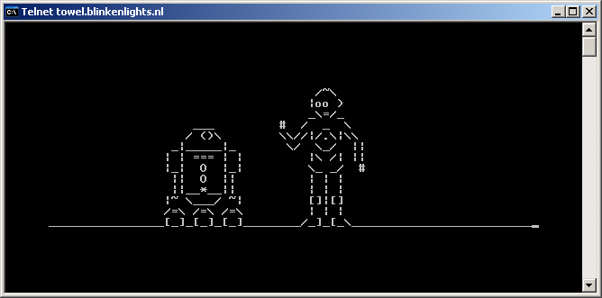

# processing-assignment-1

In this assignment you will be using println to create formatted console output, including ASCII art.

1. After accepting the assignment through GitHub clone your repository so you can work on it locally.
2. Create a new sketch in Processing using an appropriate name in your local repository.
3. Once you start coding make sure you commit and push/sync after adding/revising each new functional code chunk. Your commits have to be small and take place often.
4. Hitting the play button in Processing will run your program. Be sure to run each part of the program before moving on to the next.

To: Using escape characters is not required but may help you

\” - to print a quotation mark

\n - to create a new line

\t - to tab 3 spaces

\\ - to print a backslash - this is needed for some ASCII art

## Part 1
Write code that console prints the first six letters of your first and/or last names so that it looks like the following example.  When ran, the letters must line up properly.

## Part 2
What is ASCII art?  ASCII is the set of symbols (letters, punctuation marks and numbers) that make up the English language.  In the computer world, each of these ASCII symbols is assigned a number so that we can tell the computer what to print in binary.  For example: the capital letter P is represented by the number 80 which is 01010000 in binary. You do not need to know about binary or how ASCII works,... yet.  

Go to the site http://asciiart.en.utf8art.com/ and look at some of the examples of ASCII art.  Then, write code to print a simple work of ASCII art. You can find one and copy it or make it up on your own. Your art should take between 10-15 and lines of code.  (Feel free to do something even bigger if you have time.)

